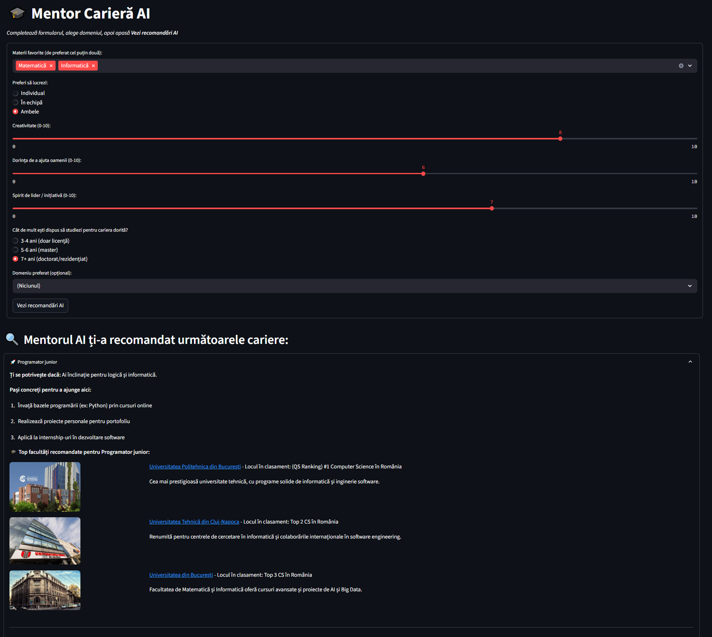

## Link către site: https://aicareermentor.streamlit.app/

## 🎓 Mentor Carieră AI

**Mentor Carieră AI** este o aplicație web scrisă în **Python**, proiectată sub forma unui site interactiv, care te ajută să descoperi cariera potrivită în funcție de profilul și preferințele tale. Aceasta are la baza peste 1200 de linii de cod și un AI inteligent folosit pentru a precalcula variantele de răspuns și algoritmul în sine.

---

## 🔑 Caracteristici principale

1. **Selecție personalizată de materii**  
   Alegi materiile favorite și prioritățile tale (creativitate, empatie, spirit de lider), iar algoritmul le ia în calcul pentru potrivirea cu diverse cariere.  

2. **Portabilitate extinsă**  
   Adaptat atât pentru desktop, cât și pentru telefon sau tableta, fiind disponibil pe toate device-urile.

3. **Recomandări AI “on-the-fly”**  
   Folosește **Streamlit** pentru a genera rapid (în doar câteva secunde) topul a până la 5 cariere care se potrivesc cel mai bine profilului tău.

4. **Secțiuni extinse cu `st.expander`**  
   Fiecare carieră recomandată are o zonă collapsible pentru detalii (motivul potrivirii, pași concreți și top-facultăți).

5. **Top facultăți recomandate**  
   Pentru fiecare carieră, afișăm primele 3 instituții de învățământ, cu logo/poză, linkuri și detalii (loc în clasament, descriere).

6. **Descărcare recomandări**  
   Poți salva recomandările ca fișier text cu un singur clic, prin widget-ul `st.download_button`.

7. **Design și UX**  
   - Layout „wide” pentru o experiență plăcută  
   - CSS personalizat pentru un look modern (fonturi Montserrat, paletă întunecată + accente aurii)  
   - Componente vizuale elegante și feedback instant (baloane, animații)

---

## 🛠️ Tehnologii folosite

- **[Streamlit](https://pypi.org/project/streamlit/)** (Open-source Python framework pentru rapid prototyping) 
- **[Folium](https://python-visualization.github.io/folium/)** (Hartă interactivă bazată pe Leaflet)
- **[Requests](https://en.wikipedia.org/wiki/Requests_(software))** (HTTP client pentru Python)
- **HTML/CSS** prin `streamlit.components.v1.html` pentru personalizare avansată

---
